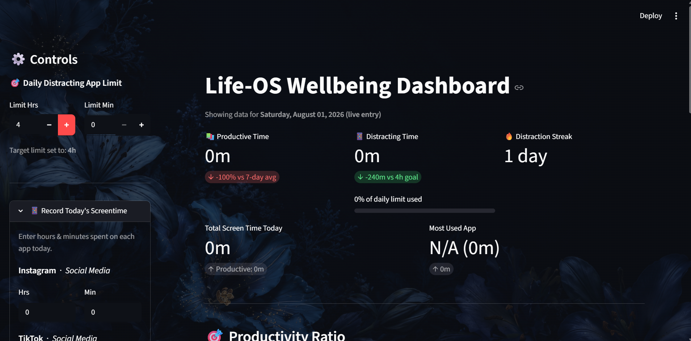
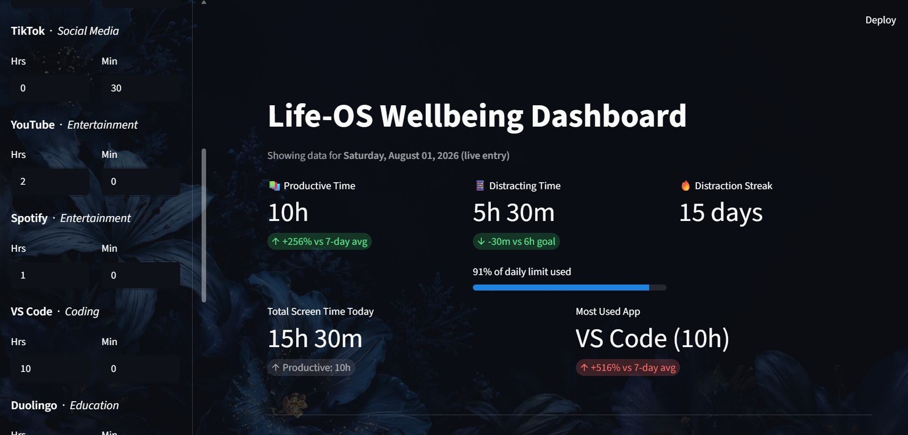
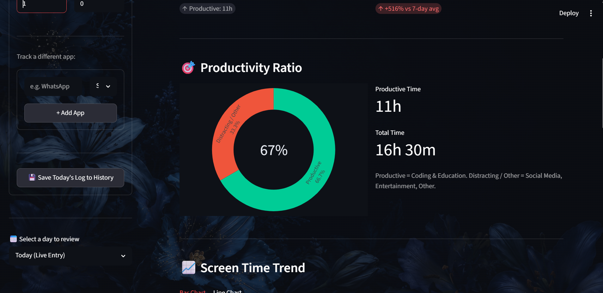
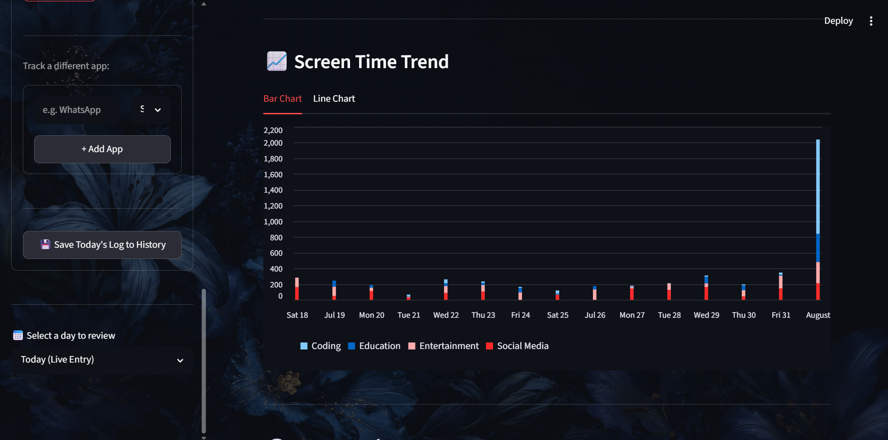
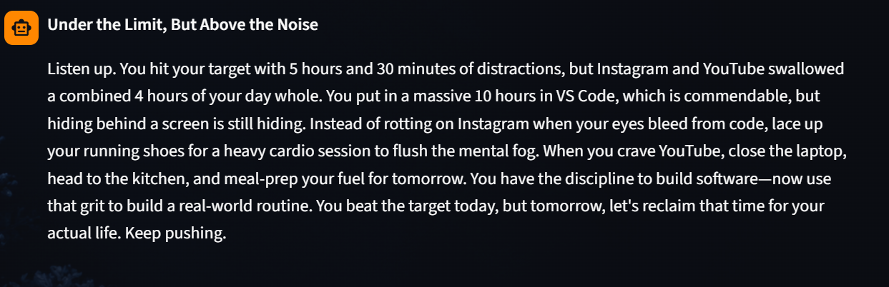
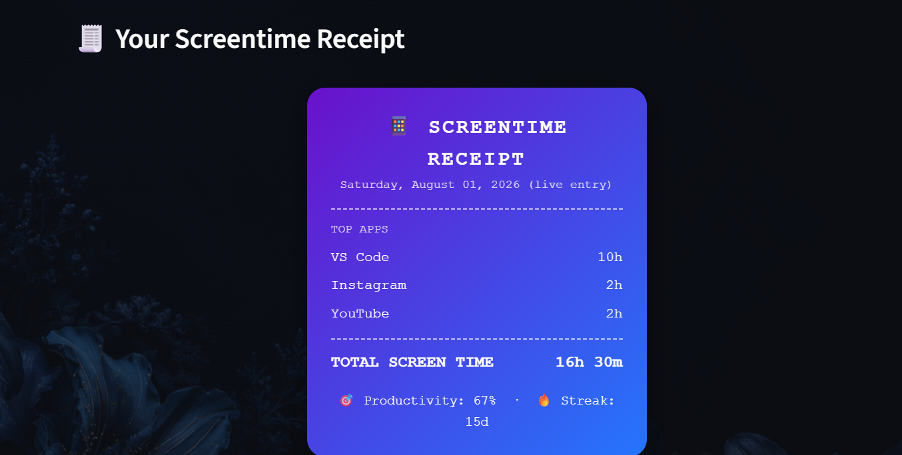
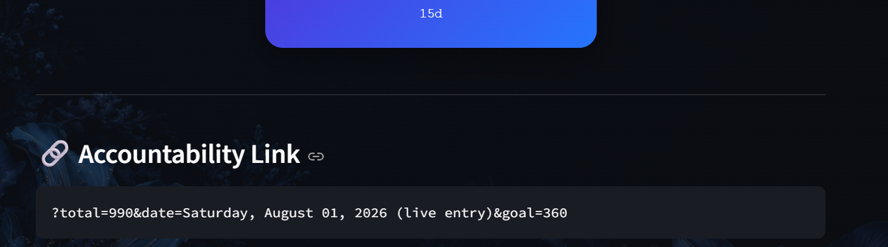

# 🧠 Life-OS Wellbeing Dashboard

A Streamlit dashboard that tracks daily screen time, separates it into productive vs. distracting categories, and pairs the data with an AI coach (powered by Google Gemini) that gives specific, real-world suggestions instead of generic "use your phone less" advice.

---

## What it does

**Log your day.** The sidebar lets you enter hours/minutes spent on a preset list of apps (Instagram, TikTok, YouTube, Spotify, VS Code, Duolingo) or add your own custom app with a category. Saving writes the entry into `screentime.csv`, which persists across sessions.

**See where your time actually went.** The main dashboard shows:
- A **productivity ratio** donut chart splitting time into Productive (Coding, Education) vs. Distracting (Social Media, Entertainment) vs. Neutral
- Key metrics for productive time, distracting time (with a progress bar against your daily limit), and your current "distraction streak"
- A comparison of today's most-used app against your 7-day average, so you can see if you're trending up or down
- Bar and line charts of your usage trend over time

**Set a limit and track a streak.** You define a daily cap for distracting-app time. The app calculates a running streak of consecutive days you stayed under that limit — miss the goal, and the streak resets.

**Get coached by AI, not lectured.** Clicking "Start Coaching Session" sends your day's category and app breakdown to Gemini, which is deliberately prompted to name the specific app that ate your time and suggest a concrete physical-world alternative (a workout, meal prep, reading, etc.) rather than vague advice. You can then keep chatting with it about your day — each date gets its own isolated conversation thread.

**Get a receipt.** A styled, card-style "screentime receipt" renders your top 3 apps, total time, productivity percentage, and streak in one shareable-looking summary.

**Share your results.** The app encodes your totals and goal into the page's URL via `st.query_params`, so you can copy a link and send it to someone as proof of whether you hit your target that day.

---


## 🖼️ Screenshots

| | |
|---|---|
|  |  |
|  |  |
|  |  |
|  

---
## How it's built

- **`st.session_state`** tracks the list of monitored apps and today's live (unsaved) entries, so nothing is lost between reruns while you're still filling out the form.
- **Mixed-date handling** — `pandas.to_datetime(..., format='mixed')` lets the app merge historical CSV timestamps with today's freshly-created entry without breaking on inconsistent date formats.
- **Category mapping** — a simple dictionary (`CATEGORY_TYPE`) tags each app category as Productive, Distracting, or Neutral, which drives every ratio/metric calculation in the app.
- **Streak logic** walks backward through daily distracting-time totals and counts consecutive days at or under the goal, stopping at the first day that breaks it.
- **AI responses are JSON-constrained** — the Gemini prompt requires a strict `{"headline": ..., "advice": ...}` shape so the UI can render it consistently instead of parsing free-form text.
- **Background styling** — `wallpaper.png` is read, base64-encoded, and injected as a CSS background behind both the main view and sidebar, with a dark overlay for readability.

---

## Tech Stack

| Layer | Tools |
|---|---|
| UI Framework | Streamlit |
| Data | Pandas |
| Charts | Plotly (donut), native Streamlit bar/line charts |
| AI | Google Gemini (`google-genai`) |
| Config | python-dotenv |

---

## Running it locally

**1. Clone the repo**
```bash
git clone https://github.com/aasrithavalluri30-source/miraiinternship.git
cd miraiinternship/Life-OS
```

**2. Install dependencies**
```bash
pip install -r requirements.txt
```

**3. Add your API key**

Create a `.env` file in this folder:
```
GEMINI_API_KEY=your_key_here
```

**4. Run it**
```bash
streamlit run app.py
```

`screentime.csv` and `wallpaper.png` are already included, so the app runs with a working dataset out of the box.

---

## Live Demo

🌐 [Try it live](https://life-os-wellbeing.streamlit.app)
---
🙌 Acknowledgments
Built for the Mirai School of Technology Virtual Summer Internship 2026
