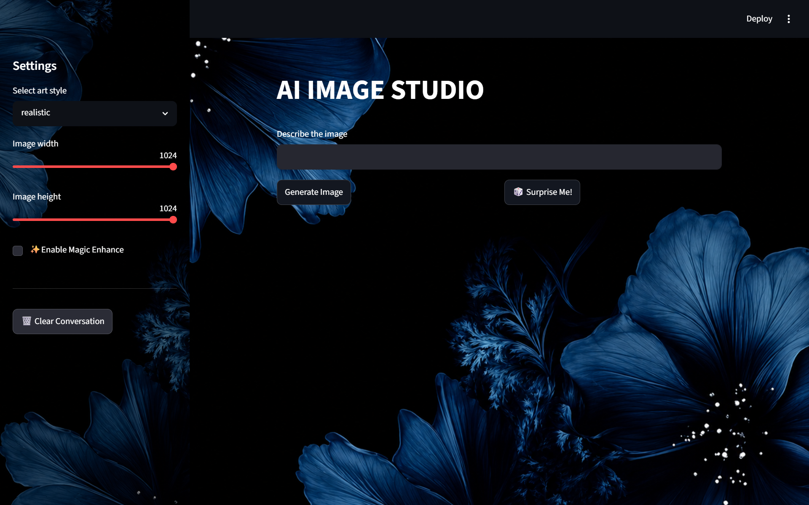
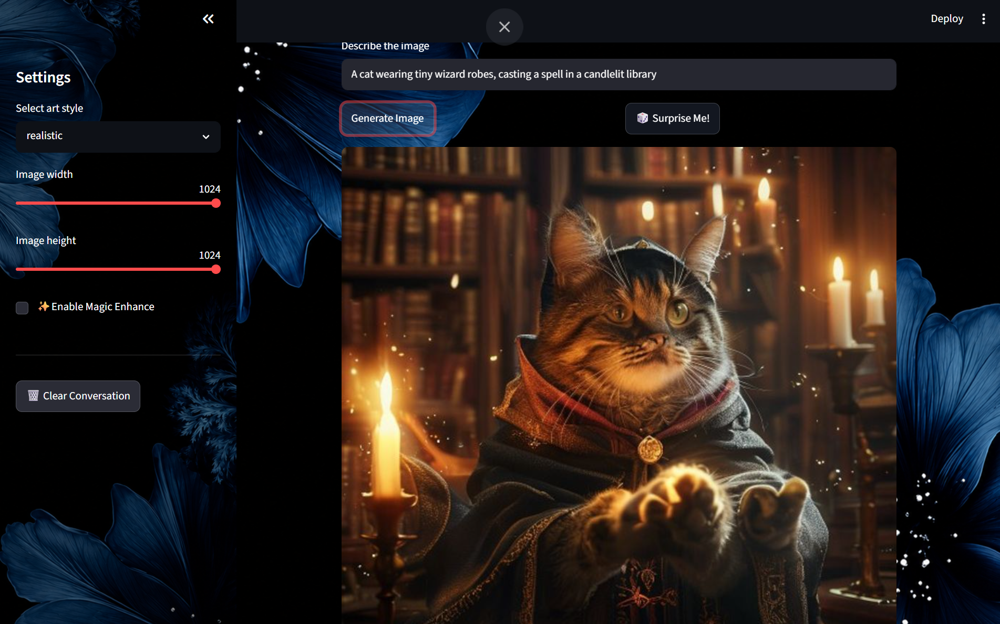
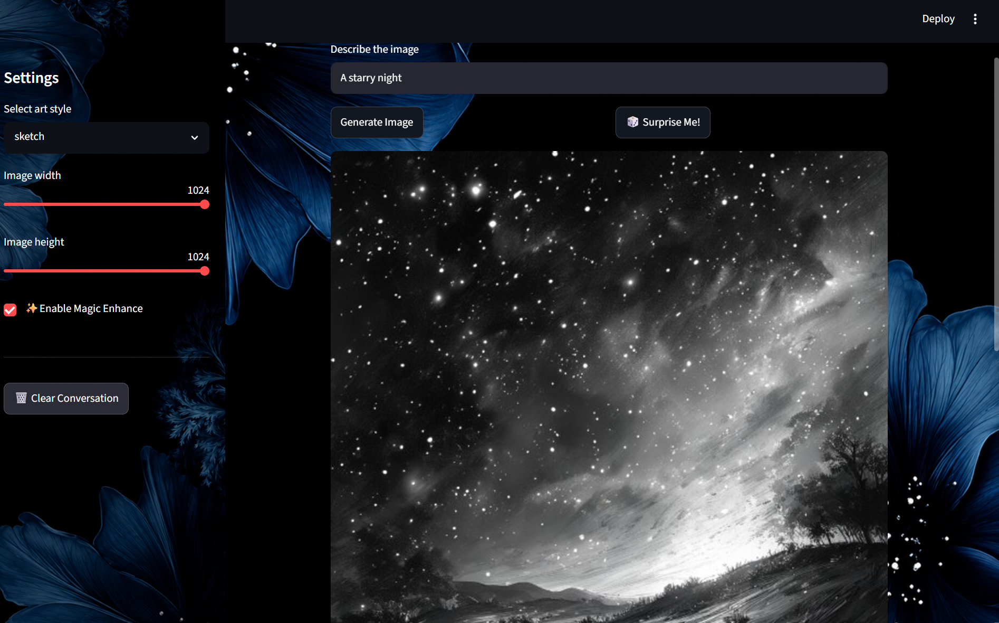
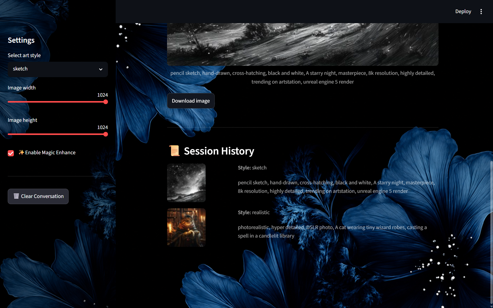
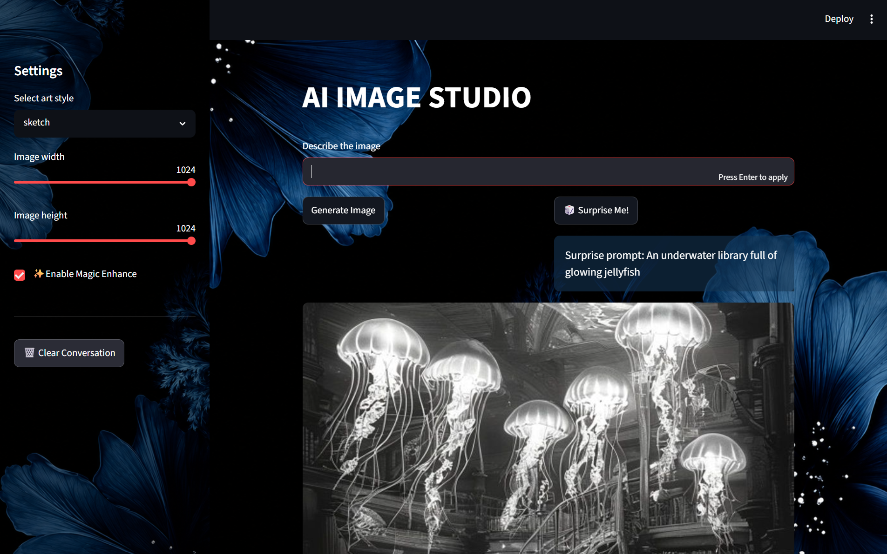
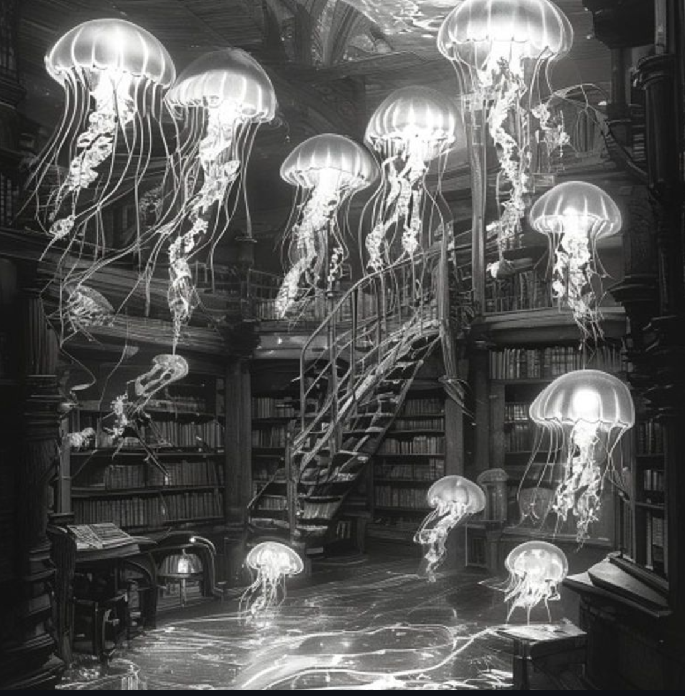
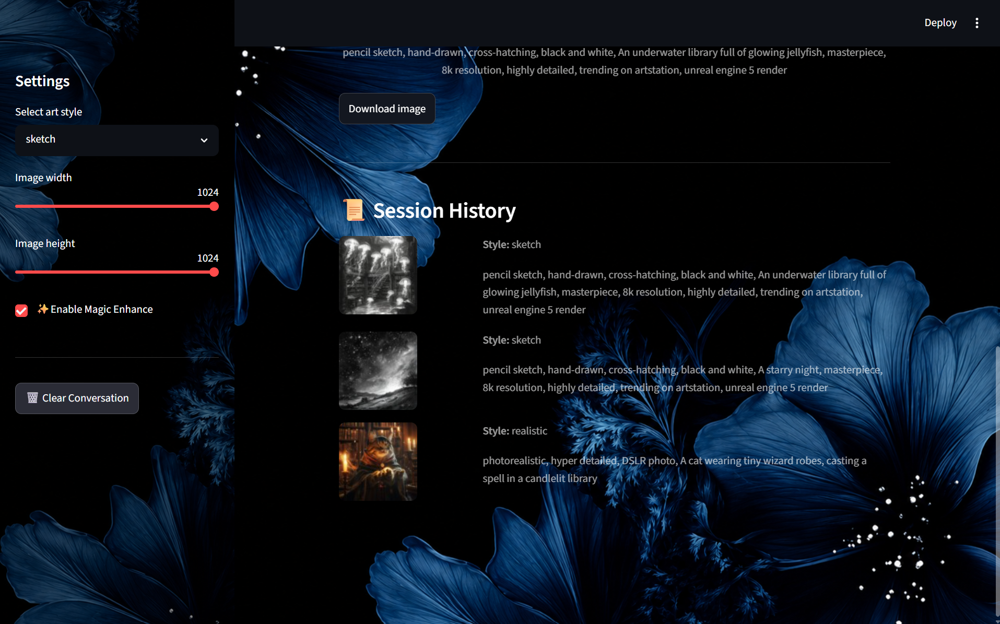

# 🎨 AI Image Studio

An interactive AI-powered image generation studio built with **Streamlit** and the **Pollinations AI** API. Describe an idea, pick an art style, and generate a custom image in seconds — or let the app surprise you with a random creative prompt.

---

## 🎥 Demo

https://drive.google.com/file/d/1xmRRKRfNZTGuZ_7WYPky31tQujvZutur/view?usp=sharing

---

## ✨ Features

- **Custom Image Generation** — describe any scene or idea in plain text and generate an AI image instantly
- **Art Style Selector** — choose from Anime, Vintage, Realistic, Sketch, or 3D Render styles, each with tuned style descriptors for more consistent results
- **Adjustable Dimensions** — width and height sliders that *actually* control the generated image size (256px–1024px)
- **Magic Enhance Toggle** — automatically boosts your prompt with quality keywords (`masterpiece, 8k resolution, highly detailed...`) for users who want better results without writing a detailed prompt themselves
- **Surprise Me!** — stuck on ideas? Instantly generate an image from a curated list of creative prompts
- **One-Click Download** — download your generated image as a properly named `.png` file (auto-named after the selected art style)
- **Session History** — browse a gallery of every image generated during your session, complete with thumbnails and the exact prompt used
- **Clear Conversation** — reset your session and history with a single click
- **Custom Themed UI** — full background image styling across both the main page and sidebar

---

## 🖼️ Screenshots

| | |
|---|---|
|  |  |
|  |  |
|  |  |
|  |  |

---

## 🛠️ Tech Stack

- **[Streamlit](https://streamlit.io/)** — Python web app framework for the entire UI
- **[Pollinations AI](https://pollinations.ai/)** — free, open image generation API
- **Python `requests`** — for making HTTP calls to the image generation API
- **Python `random`** — powers the "Surprise Me!" feature
- **Python `base64`** — encodes the local background image for CSS embedding

---

## 📌 Notes

- Pollinations AI is a free public API — generation times may vary, and occasional slow responses or rate limits are expected under heavy use.
- This project was built for educational purposes as part of an internship assignment and is not intended as a production SaaS product.

---
