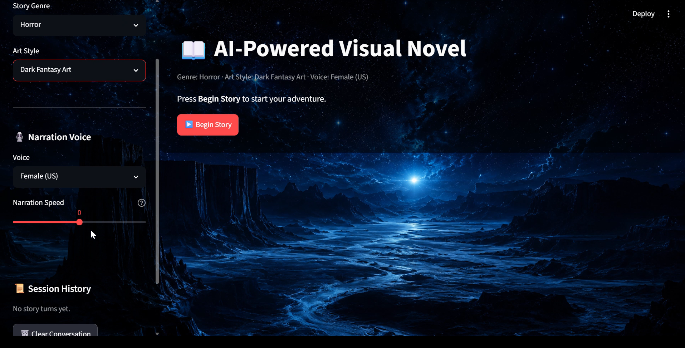
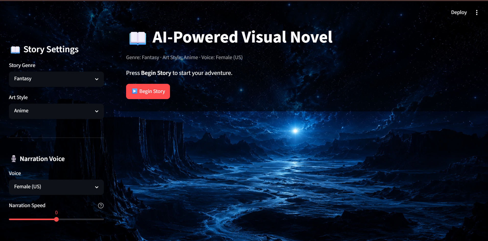
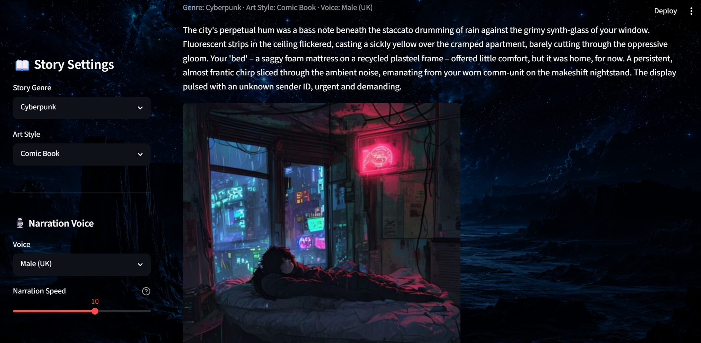
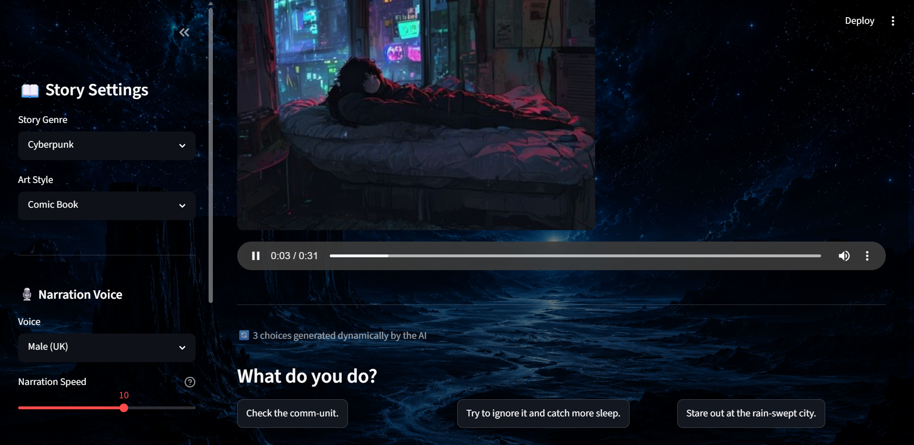
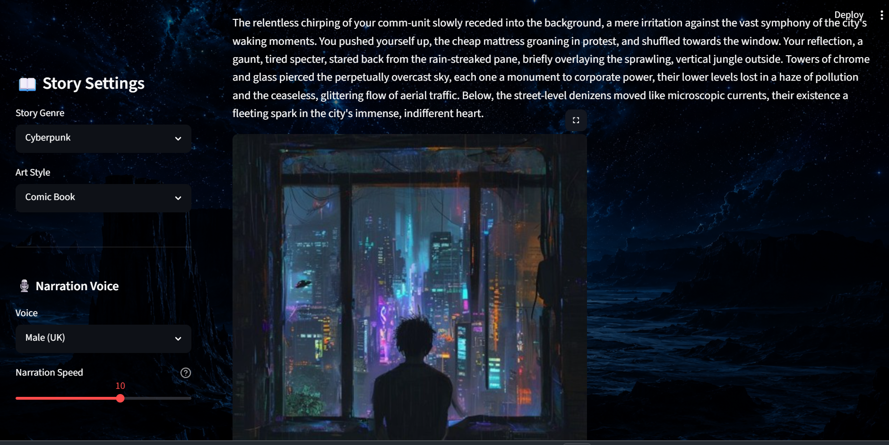
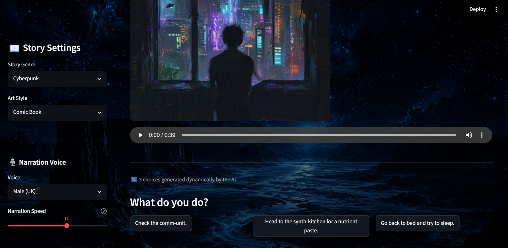
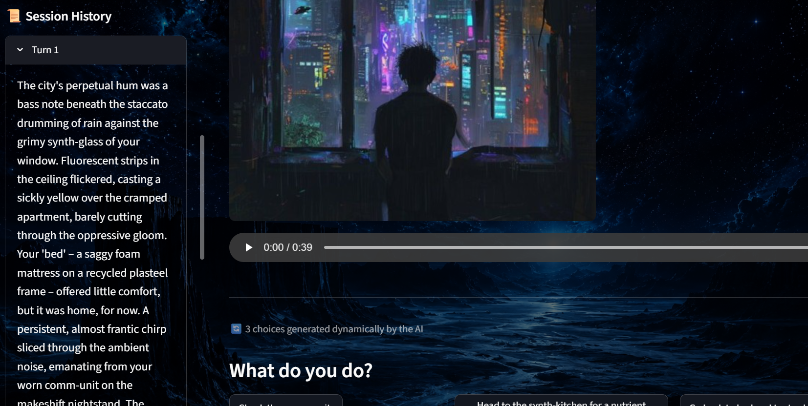

# 📖 AI-Powered Visual Novel

A "Choose Your Own Adventure" style visual novel built with Streamlit, powered by **Google Gemini** for stateful story generation, **Pollinations** for AI-generated scene art, and **edge-tts** for narrated audio — all wrapped in a custom-themed Streamlit UI.

Built as the Capstone Mini-Project for Mirai School of Technology's Virtual Summer Internship 2026 — "AI Builder" Track.

---

## 🎥 Demo

▶️ **[Watch the demo video](https://drive.google.com/file/d/1a6HCsphfrjY0n5eZWiSIh6QF1SUpxOf-/view?usp=sharing)**

## 🖼️ Screenshots

| | |
|---|---|
|  |  |
|  |  |
|  |  |
| | 


---

## ✨ Features

- **Stateful story engine** — Gemini remembers the full conversation via a persistent chat session, so the narrative stays consistent turn after turn.
- **Structured JSON output** — every AI response is parsed into `story_text`, `image_prompt`, and `options` using Python's `json` library, instead of relying on loose freeform text.
- **Dynamic UI generation** — choice buttons aren't hardcoded. A `for` loop builds one `st.button()` per option the AI returns (2–3 choices), so the UI changes shape every turn.
- **AI-generated scene art** — each turn's `image_prompt` is sent to the Pollinations image API and rendered inline with the story.
- **Narrated audio** — story text is converted to speech using `edge-tts`, with a choice of multiple voices (different genders/accents) and adjustable narration speed, played back via `st.audio()`.
- **Persistent history** — story text, images, and audio are all stored in `st.session_state`, so previous turns stay visible as the story progresses instead of disappearing on rerun.
- **Custom UI theming** — a full-page custom background image with translucent panels behind text/sidebar for readability.
- **Graceful failure handling** — every external API call (Gemini, Pollinations, edge-tts) is wrapped in `try/except`. If an API is slow or down, the app shows a non-blocking `st.toast()` warning and keeps going instead of crashing with a traceback.

---

## 🛠️ Tech Stack

| Piece | Tool |
|---|---|
| App framework | [Streamlit](https://streamlit.io/) |
| Story generation | [Google Gemini API](https://ai.google.dev/) (`google-genai` SDK) |
| Image generation | [Pollinations](https://pollinations.ai/) |
| Text-to-speech | [edge-tts](https://github.com/rany2/edge-tts) |
| Config / secrets | `python-dotenv` |

---

## 🚀 Running It Locally

### 1. Clone the repo
```bash
git clone https://github.com/aasrithavalluri30-source/miraiinternship.git
cd miraiinternship/capstone_project_1
```

### 2. Install dependencies
```bash
pip install -r requirements.txt
```

### 3. Set up your API key
Create a `.env` file in the same folder as `app.py`:
```
gemini_new_key=YOUR_GEMINI_API_KEY_HERE
```
Get a free key at [aistudio.google.com](https://aistudio.google.com/apikey).

> ⚠️ `.env` is git-ignored — never commit your real API key.

### 4. Add a background image
Drop a `background.png` into the project folder (same directory as `app.py`), or update `BACKGROUND_IMAGE_PATH` in `app.py` to match your filename.

### 5. Run the app
```bash
streamlit run app.py
```

---

## 📂 Project Structure

```
.
├── app.py              # Main Streamlit application
├── requirements.txt     # Python dependencies
├── .env                 # Your API key (not committed)
├── .gitignore
├── background.png       # Custom background image
└── screenshots/         # App screenshots for this README
```

---

## 🎮 How It Works

1. Pick a **Genre**, **Art Style**, and narration **Voice** from the sidebar.
2. Click **▶️ Begin Story** — Gemini generates the opening scene as structured JSON.
3. The app parses that JSON, fetches a matching scene image from Pollinations, and generates narrated audio with edge-tts.
4. Choice buttons are generated dynamically based on however many options the AI returned.
5. Click a choice → it's sent back to Gemini as your next move → the story continues, with all previous turns still visible above.
6. If any API call fails, the app shows a friendly toast notification and keeps the story going.

---

## 🙌 Acknowledgments

Built for the Mirai School of Technology Virtual Summer Internship 2026 — "AI Builder" Track Capstone Project.
