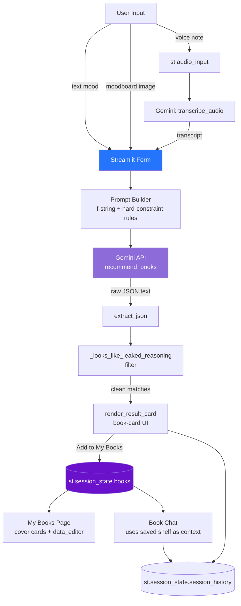

# ✦ Vibe Shelf — Find Your Next Story

A mood-driven book discovery app. Instead of searching by title or author, you describe the *feeling* you want to disappear into — through text, an uploaded moodboard image, or even a spoken voice note — and Gemini finds three real books that actually match it.

Built with a hand-crafted glassmorphic, cosmic UI: animated starfields, aurora gradients, and a color theme that shifts per genre.
📄 See [`DESIGN.md`](./DESIGN.md) for the full technical design document — data flow, API integration strategy, and a breakdown of every logic module.

---

## ✨ Features

### 🔮 Matchmaker — multimodal mood matching
- **Text, image, or voice** — describe your mood in words, upload a moodboard image for palette/atmosphere, or record a spoken vibe note that gets transcribed and read alongside your other signals.
- **Genre blending** — pick a preset genre room or write your own hybrid (e.g. *"gothic fantasy + literary mystery"*).
- **Trope alchemy** — choose from a curated trope library or type your own custom trope on the fly via `accept_new_options`.
- **Pacing & tone sliders** — dial in exactly how slow-burn or breathless, tender or dark you want the story.
- **Hard-constraint prompting** — if you name a specific element (vampires, a heist, a locked-room murder), every recommendation is required to actually contain it — no "atmospherically similar but doesn't have vampires" results.
- **Self-checking + anti-hallucination guards** — the model is instructed to silently verify each pick before answering, and a second pass (`_looks_like_leaked_reasoning`) filters out any stray "wait, actually…" self-correction text that might slip into a response.
- **Debug view** — expand a panel to see the *exact* prompt sent to Gemini and the raw JSON it returned, for full transparency into how a match was made.

### 📚 My Books — your personal shelf
- Add books manually, rate them 0–5 stars, and write a short review underneath.
- Books render as **glowing cover cards** with a rotating color palette, plus a spreadsheet-style **quick-edit table** for fast bulk updates to chapter progress, ratings, and reviews.
- A **mood color picker** lets you retint the whole page's background glow to match your shelf's vibe — safely, via a hex-validation guard (`safe_hex_color`) that only allows real 6-digit hex codes into the CSS.
- A small **world map of bookish cities** for a decorative, atmospheric touch.

### 💬 Book Chat — one open conversation
- A single freeform chat — no rigid menus. Ask for recommendations, request a character to roleplay as, ask factual/literary questions, or discuss your saved shelf.
- **Strict accuracy rules baked into the prompt** — the assistant is instructed to silently verify character/book identities, never merge details from similarly-named books, and say *"I'm not certain enough to state that as fact"* rather than inventing an answer.
- Remembers your saved books and recent conversation turns as context for every reply.

### 🎨 Design details worth knowing about
- Fully custom CSS: animated stardust particles, shifting aurora gradients, glassmorphism cards, and a genre-reactive sidebar that recolors itself based on your selected genre.
- **Session history** — a running log (up to the last 30 events) of every match, story action, and book edit this session, rendered via `st.fragment` for a snappier feel, with a graceful fallback for older Streamlit versions that don't support fragments.
- **Injection-safe theming** — any user-provided color (mood pickers) is validated with a regex before being placed into raw CSS, so a malformed value can't break or hijack the page's styling.

---

## 🛠️ Tech Stack

| Piece | Tool |
|---|---|
| App framework | Streamlit |
| AI engine | Google Gemini (`google-genai` SDK) — text, image, and audio input |
| Data | Pandas |
| Image handling | Pillow |
| Config | python-dotenv |

---

## 🖥️ System Snapshot

```text
$ cat vibe_shelf/system_info.txt
────────────────────────────────────────────────────
  PROJECT      : Vibe Shelf — Find Your Next Story
  CATEGORY     : Aesthetic Book Matchmaker (Capstone #24)
  FRAMEWORK    : Streamlit
  AI ENGINE    : Google Gemini (google-genai SDK)
  INPUT MODES  : text · image (moodboard) · voice (mic)
  DATA LAYER   : Pandas (map data), st.session_state (shelf)
  STATE        : persistent across reruns via session_state
  STATUS       : ● online
────────────────────────────────────────────────────

$ cat vibe_shelf/architecture.txt
[ User Input ]
      │  text / image / audio
      ▼
[ Streamlit Form ]───────────────┐
      │                          │
      ▼                          ▼
[ Prompt Builder ]        [ Audio → Transcript ]
      │  f-string + rules        │
      ▼                          │
[ Gemini API ] ◄──────────────────┘
      │  JSON response
      ▼
[ JSON Parser + Leak Filter ]
      │  clean, verified matches
      ▼
[ Render: book-card UI ]
      │
      ▼
[ st.session_state ] ── persists across reruns
────────────────────────────────────────────────────
```

---
## 🏗️ Architecture Diagram




**1. Clone the repo**
```bash
git clone https://github.com/aasrithavalluri30-source/miraiinternship.git
cd "miraiinternship/capstone_project_final"
```

**2. Install dependencies**
```bash
pip install -r requirements.txt
```

**3. Add your API key**

Create a `.env` file in this folder:
```
GEMINI_API_KEY=your_key_here
```
(The app also accepts `GOOGLE_API_KEY` as a fallback if you already have that set.)

**4. Run it**
```bash
streamlit run app.py
```

---

## 🌐 Live Demo
https://vibe-shelf-books.streamlit.app/

---

> Not every book is for every mood. Vibe Shelf just helps you find the one that is.
