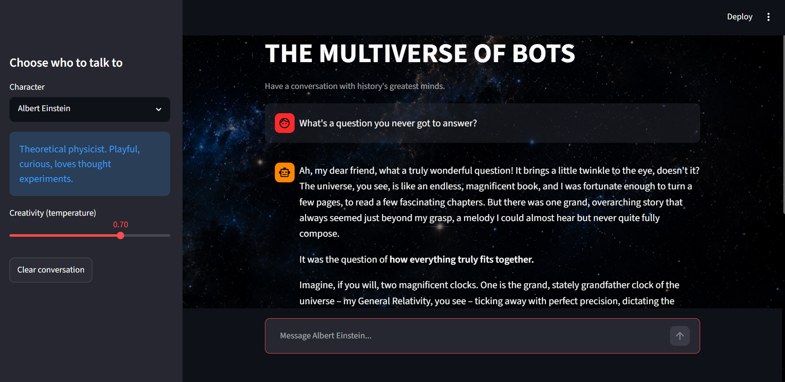
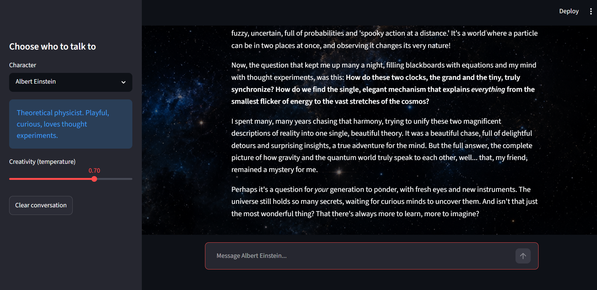
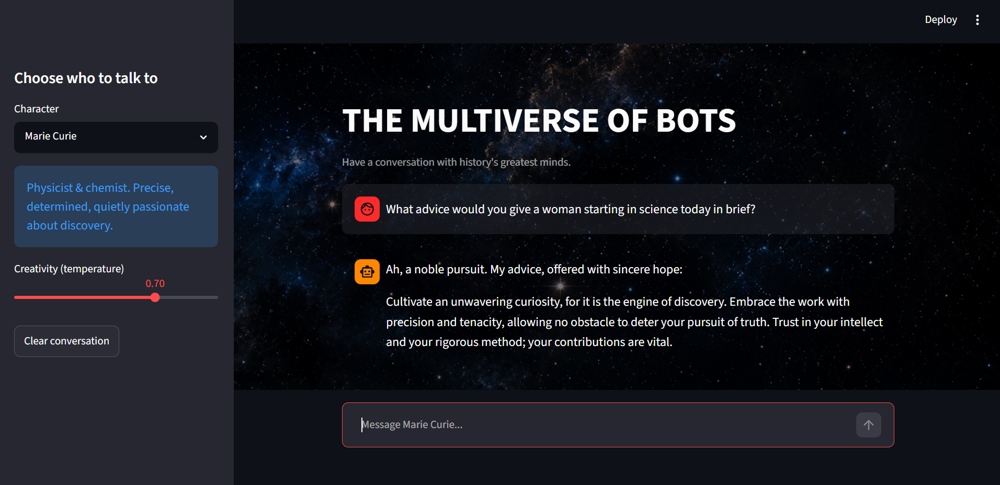
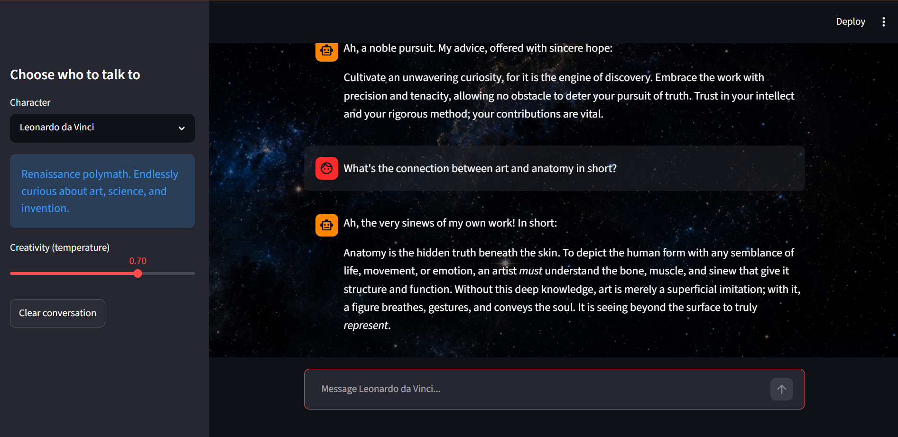

# Multiverse Assignment 3 — The Memory Vault (Stateful Chatbot)

A Streamlit chatbot that lets you have conversations with historical figures — Albert Einstein, Marie Curie, Leonardo da Vinci, Nikola Tesla, Cleopatra, Abraham Lincoln, Ada Lovelace, Sigmund Freud, William Shakespeare, and Confucius — powered by Google's Gemini API.

## Assignment Objective

This upgrades the chatbot from **stateless** (forgot everything on every rerun) to **stateful** (remembers the full conversation) using Streamlit's `st.session_state`.

## Features

- **Persistent memory** — chat history survives every rerun via `st.session_state.messages`
- **Native chat UI** — built with `st.chat_input` and `st.chat_message` (walrus operator pattern)
- **Multiple personalities** — each character has a distinct system instruction guiding tone and behavior
- **Adjustable creativity** — temperature slider controls response randomness
- **Custom background image** — nebula/space theme rendered behind the app
- **Per-session memory** — switching characters mid-conversation keeps chat history on screen

## How It Works

1. `st.session_state.messages` is initialized as an empty list on first run
2. Every past message is redrawn on each rerun via a `for` loop + `st.chat_message()`
3. New input is captured with `if user_message := st.chat_input(...)`
4. Both the user's message and Gemini's response are appended back into `st.session_state.messages`

## Screenshots

# Demo Video

🎥 [Watch the 3-message memory demo](https://drive.google.com/file/d/1X5ebgkuiH_tk9x4XZIPBqhvPbum2hiUw/view?usp=sharing)

